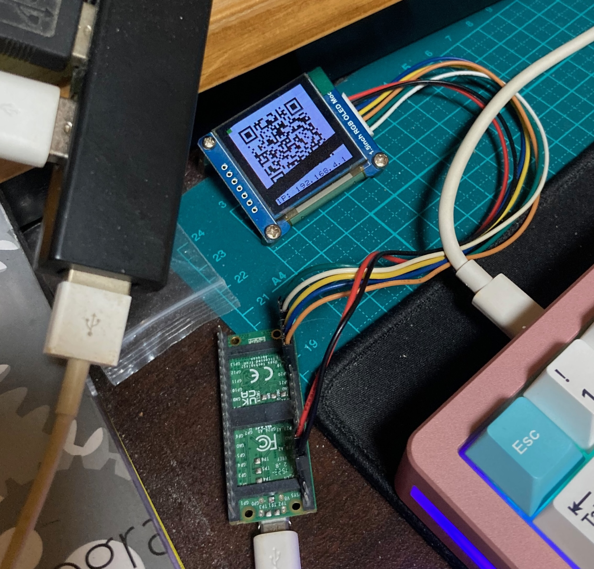

# 履歴書を作成・共有可能なデバイス

Raspberry Pi Pico WH によるポータブル履歴書



## 概要

- Pico WH の Wi-Fi STA モードで、既存 Wi-Fi AP に接続する
- Pico WH を新規 Wi-Fi AP にする
- QR コード生成機能
  - OLED に QR コード表示
  - 焼き付き防止
    - 120 秒表示
    - 1 秒非表示
  - QR コードで Wi-Fi AP に自動接続
- Pico WH を Web サーバにする
  - 履歴書作成フォームを提供
  - 履歴書データ読み込み・書き込み API を提供
  - 証明写真アップロード機能
  - 履歴書生成機能を提供
  - 同時接続 1-2 人を想定
  - Wi-Fi AP 経由、STA 経由どちらからもアクセス可能
- 履歴書データは約 1.5MB 保存可能
- 外部ライブラリ使用不可
- インターネット接続不可
- HTTP リクエスト・レスポンスと `.csv` ファイルの読み書きなどあらゆるデータを chunk で処理
- 192.168.xx.mm からのアクセスで管理用リンクメニューを表示

ハード構成図:

```text
                     ┌─────────────────────────────┐
                     │ Raspberry Pi Pico WH        │
┌───────────────┐    ├─────────────────────────────┤    ┌────────────────┐
│ Computer      ├───▶︎│ 192.168.xx.nn   192.168.4.1 │◀︎───┤ Other Computer │
│ 192.168.xx.mm │    │ Wi-Fi STA       Wi-Fi AP    │    │ 192.168.4.ii   │
└───────────────┘    ├────────────┬────────┬───────┘    └────────┬───────┘
                     │ Flash mem  │ ┌──────┴───────┐             │
                     │ (CSV data) │ │ OLED SSD1351 │◀︎────────────┘
                     └────────────┘ │ (QR code)    │   Camera scan
                                    └──────────────┘
```

ソフト構成図:

```text
┌──────────────┐    ┌─────────────────────┐    ┌───────────────┐
│  secrets.py  │───▶│       main.py       │───▶│    network    │
│   (Config)   │    │    (Entry Point)    │    │ (WLAN AP/STA) │
└──────────────┘    └──────────┬──────────┘    └───────────────┘
                               │
        ┌──────────────────────┤
        ▼                      ▼
 ┌──────────────┐       ┌──────────────┐     ┌──────────┐
 │  display.py  │       │    web.py    │◀︎───▶│   www/   │
 │ (OLED Ctrl)  │       │ (Web Server) │     │ (Static) │
 └──────┬───────┘       └──────┬───────┘     └──────────┘
        ▼ Uses                 ▼
┌────────────────┐      ┌──────────────┐
│     lib/       │      │  storage.py  │
│ (SSD1351, uQR) │      │ (Data Model) │
└───────┬────────┘      └──────┬───────┘
        ▼                      ▼
   ┏━━━━━━━━━┓           ┌───────────┐
   ┃  OLED   ┃           │ CSV Files │
   ┃ Display ┃           │  (Flash)  │
   ┗━━━━━━━━━┛           └───────────┘
```

## ハードウェア

- [Raspberry Pi Pico WH](https://www.raspberrypi.com/products/raspberry-pi-pico/) (≠ Pico2 WH)
- [Waveshare 1.5inch RGB OLED SSD1351](https://www.waveshare.com/wiki/1.5inch_RGB_OLED_Module)

### 配線

| OLED SSD1351 | Pico WH |
| ------------ | ------- |
| VCC          | 3V3     |
| GND          | GND     |
| DIN          | GP19    |
| CLK          | GP18    |
| CS           | GP20    |
| DC           | GP16    |
| RST          | GP17    |

## セットアップ手順

### 初期化

一回やればいいです。

1. Open VSCode
2. Click left pane
3. Select `Initialize MicroPico project`

### 本ソフトウェア準備

```bash
git clone git@github.com:tkumata/resumaker-pico-py.git
cd resumaker-pico-py
cp secrets.py.sample secrets.py
vi secrets.py
vi .vscode/settings.json
```

`vi secrets.py` について

| Variables    | Descriptions                      |
| ------------ | --------------------------------- |
| SSID         | SSID when Wi-Fi AP mode           |
| PASSWORD     | Wi-Fi password when Wi-Fi AP mode |
| STA_SSID     | SSID of your home Wi-Fi           |
| STA_PASSWORD | Wi-Fi password of your home Wi-Fi |

.vscode/settings.json で TTY の指定をします。Mac (M4 Macbook Air macOS Tahoe) の場合以下になります。

```json
"micropico.manualComDevice": "/dev/tty.usbmodem113201",
```

Linux (Debian 系) の場合以下になると思います。

```json
"micropico.manualComDevice": "/dev/ttyACM0",
```

## デプロイ

1. Pico WH を母艦 PC に接続
2. VSCode 左ペインを右クリック
3. `Upload project to Pico` を選択

## 使用方法

### 起動

1. Pico WH を母艦 PC から外し
2. Pico WH を電源に接続

### 管理画面

1. OLED に映った QR コードをスキャン
2. ブラウザで以下にアクセス

- http://192.168.4.1/admin/user
- http://192.168.4.1/admin/simplehist
- http://192.168.4.1/admin/jobhist
- http://192.168.4.1/admin/portrait

### 履歴書表示

1. OLED に映った QR コードをスキャン
2. http://192.168.4.1 に接続

## 仕様

- 履歴書データは、csv ファイルで以下の構成
  - user.csv: 個人情報を保存するファイル
  - jobhist.csv: 職務経歴書を保存するファイル
  - simplehist.csv: 1 行単位の学歴・職歴を保存するファイル
  - portrait.csv: ポートレイト情報を保存するファイル
- /api/user: 個人情報を呼び出す・保存する API エンドポイント
- /api/jobhist: 職務経歴書を呼び出す・保存する API エンドポイント
- /api/simplehist: 1 行単位の学歴・職歴を呼び出す・保存する API エンドポイント
- /api/portrait: ポートレイト情報を呼び出す・保存する API エンドポイント
- /api/upload: 証明写真をアップロードする API エンドポイント
